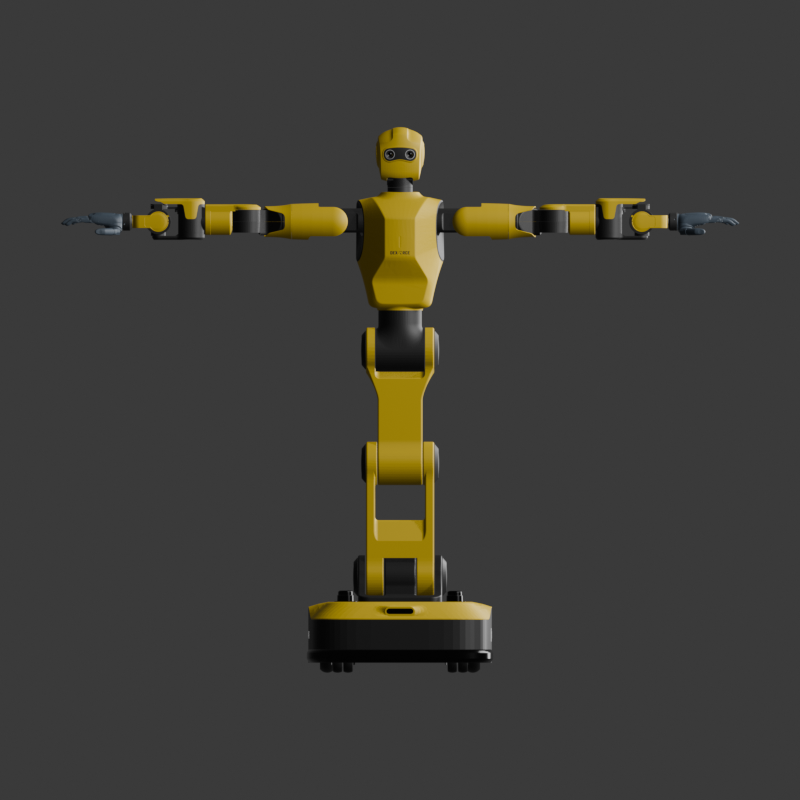
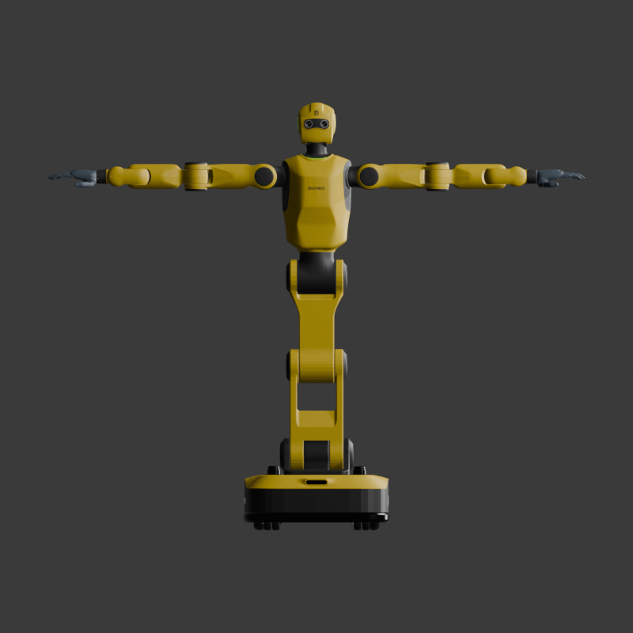
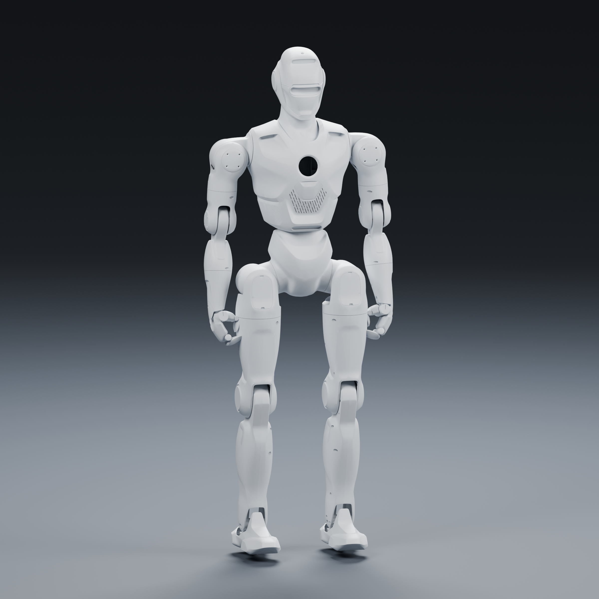
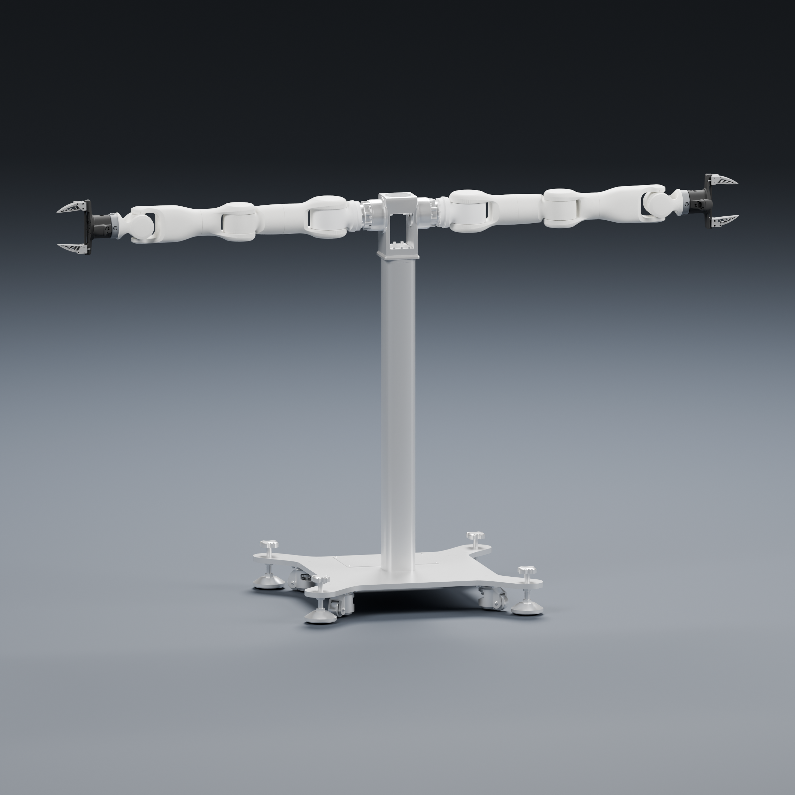
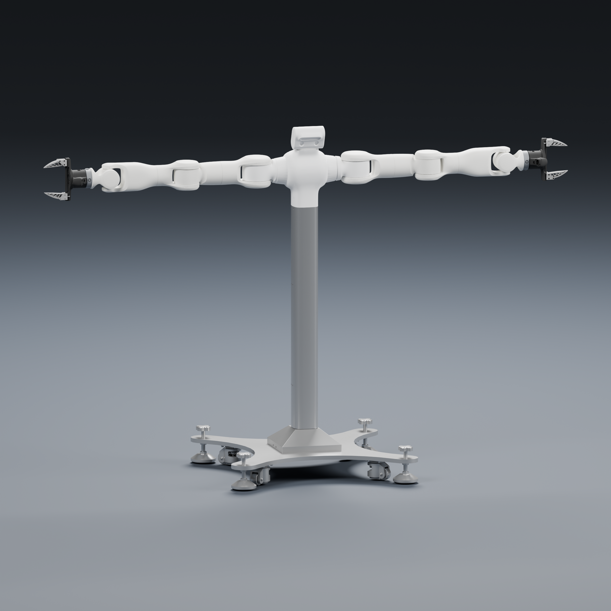
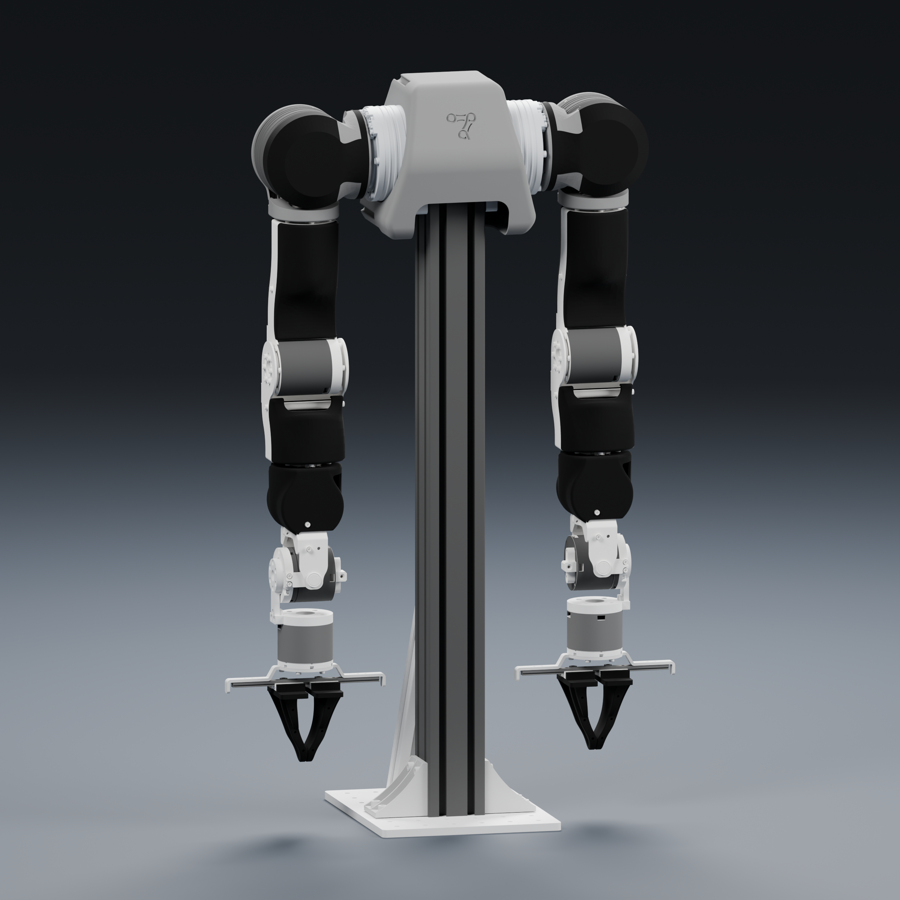
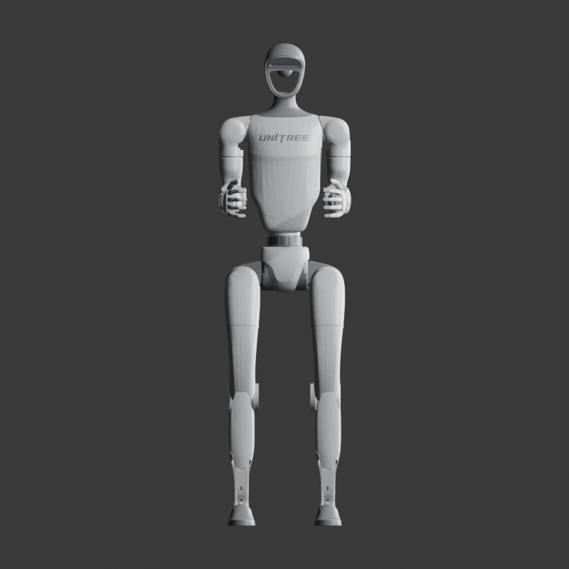
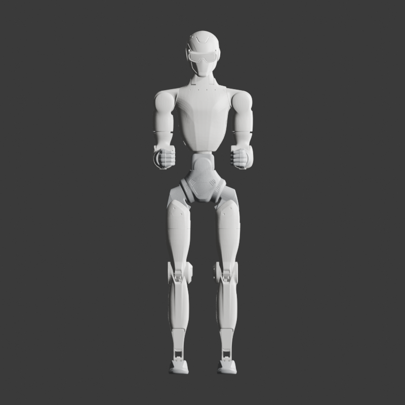
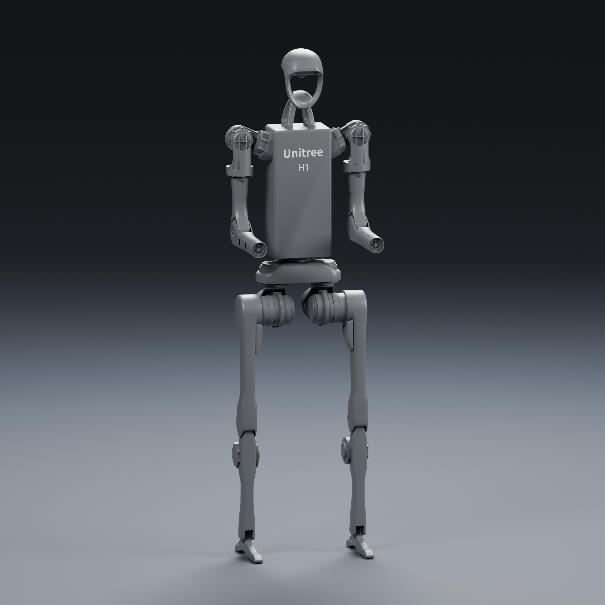
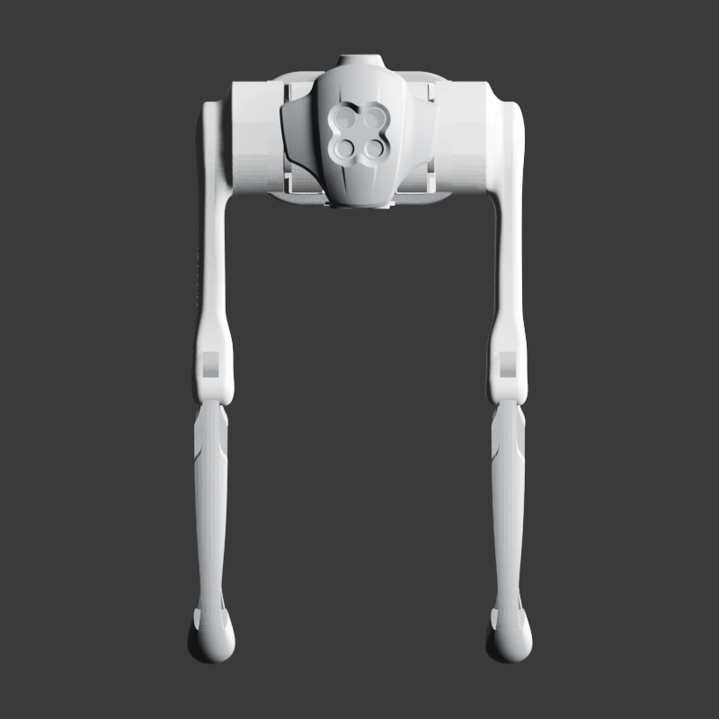

# HumanoidAssets

Standardized humanoid robot assets repository.

This repository contains reusable URDF models and paired mesh assets for simulation,
planning, and integration work.

## Repository Scope

- Full robot URDFs and modular sub-assemblies (torso, left arm, right arm)
- Visual meshes for rendering
- Collision meshes for physics and planning
- Mass and inertia definitions embedded in URDF links

## Unitree models

The repository also includes selected Unitree descriptions imported from
`unitree_ros/robots` and normalized to portable local mesh paths.
The upstream license is retained in the source package; these directories
contain the selected model assets only, not the full ROS package.
For appearance reference, see the official [Unitree product pages](https://www.unitree.com/).

| Model | Entry point | Source variant |
| --- | --- | --- |
| Unitree G1 | `UnitreeG1/robot.urdf` | G1 29-DoF |
| Unitree R1 | `UnitreeR1/robot.urdf` | R1 humanoid |
| Unitree H1 | `UnitreeH1/robot.urdf` | H1 humanoid |
| Unitree Go1 | `UnitreeGo1/robot.urdf` | Go1 quadruped |

Unitree G1 and R1 retain the collision geometry supplied by their source
URDFs. The imported H1 and Go1 descriptions provide visual geometry but do not
define independent collision meshes; add simulator-specific collision shapes
before physics or motion-planning use.

## Directory Overview

```text
.
├── Dexforce_W1_V2/
│   ├── robot.urdf
│   ├── robot_with_ee.urdf
│   ├── chassis.urdf
│   ├── torso.urdf
│   ├── head.urdf
│   ├── left_arm.urdf / right_arm.urdf
│   ├── left_hand.urdf / right_hand.urdf
│   ├── visual/
│   └── collision/
├── Dexforce_W1_V3/
│   ├── robot.urdf
│   ├── robot_with_ee.urdf
│   ├── chassis.urdf / torso.urdf / head.urdf
│   ├── left_arm.urdf / right_arm.urdf
│   ├── visual/
│   └── collision/
├── Engineai_PM01/
│   ├── urdf/robot.urdf
│   ├── xml/
│   ├── meshes/
│   └── usd/
├── Marvin_M6_S_CCS_696_V4.0/
│   ├── robot.urdf
│   ├── torso.urdf
│   ├── left_arm.urdf
│   ├── right_arm.urdf
│   ├── left_hand.urdf
│   ├── right_hand.urdf
│   ├── robot_with_ee.urdf
│   ├── visual/
│   └── collision/
├── Marvin_M6_S_CCS_696_PRO_V2.0/
│   ├── robot.urdf
│   ├── robot_with_ee.urdf
│   ├── torso.urdf
│   ├── left_arm.urdf
│   ├── right_arm.urdf
│   ├── left_hand.urdf
│   ├── right_hand.urdf
│   ├── visual/
│   └── collision/
└── OpenArm/
    ├── robot.urdf
    ├── torso.urdf
    ├── left_arm.urdf / right_arm.urdf
    ├── visual/
    └── collision/
```

## Model previews

These diagrams are generated from the checked-in robot assets and show the zero-pose visual geometry used by each main URDF.

| Model | Preview |
| --- | --- |
| Dexforce W1 V2 |  |
| Dexforce W1 V3 |  |
| EngineAI PM01 |  |
| Marvin M6 S CCS 696 V4.0 |  |
| Marvin M6 S CCS 696 Pro V2.0 |  |
| OpenArm |  |
| Unitree G1 |  |
| Unitree R1 |  |
| Unitree H1 |  |
| Unitree Go1 |  |

## Asset Conventions

- Visual meshes use `.glb` in most models.
- Unitree G1/R1/H1/Go1 visual meshes are converted to GLB under each model's
  `visual/glb/` directory; original source meshes remain available under
  `meshes/` for traceability and collision use.
- Unitree visual colors are baked into the GLB materials; their URDF files do
  not contain overriding `<material>` or `<color>` tags.
- Product appearance is aligned to the official Unitree product pages: G1/R1/H1
  use white and dark structural parts, while Go1 uses the black/grey consumer
  robot finish.
- Collision meshes use `.stl` or `.obj`, according to the model family.
- Mesh file paths in URDF are relative to each robot folder.
- Part URDF files are extracted subsets and are intended for modular loading.

## Usage Notes

- Load full robots from each `robot.urdf`.
- For Marvin with the two-finger hands attached, load
	`Marvin_M6_S_CCS_696_V4.0/robot_with_ee.urdf`.
- Load Marvin Pro M6 V2.0 from
	`Marvin_M6_S_CCS_696_PRO_V2.0/robot.urdf`, or use `robot_with_ee.urdf`
	for the complete model with the V4.0 two-finger grippers attached.
- Load EngineAI PM01 from `Engineai_PM01/urdf/robot.urdf`; its MuJoCo XML
	entry point is `Engineai_PM01/xml/serial_pm01.xml`.
- Load sub-assemblies from `torso.urdf`, `left_arm.urdf`, or `right_arm.urdf`
	when testing isolated components.
- Load Marvin hands independently from `left_hand.urdf` or `right_hand.urdf`;
	their root links are `left_ee` and `right_ee`, respectively.
- Keep directory structure unchanged so relative mesh references remain valid.

## Validation

Run these lightweight checks from the repository root after changing an asset:

```bash
for f in $(find . -name '*.urdf'); do check_urdf "$f" >/dev/null || exit 1; done
git diff --check
```

For visual changes, load the affected `robot.urdf` in a URDF viewer and verify
the zero pose, left/right orientation, mesh scale, and collision alignment.
Unitree visual geometry is provided as GLB, while the original mesh files are
kept under each model's `meshes/` directory for traceability and collision use.

## Pull request checklist

- Keep mesh references relative to the robot directory.
- Preserve existing link and joint names, limits, axes, mass, and inertia.
- Include regenerated GLB or preview files when visual geometry changes.
- Run `check_urdf` and `git diff --check`, and include the results in the PR.

## Maintenance Notes

- Avoid renaming mesh files unless all corresponding URDF references are updated.
- Preserve inertia, mass, and joint axis data unless values are re-validated.
- If assets are regenerated from CAD/export tools, keep this README and URDF
	comments synchronized with the new layout.
